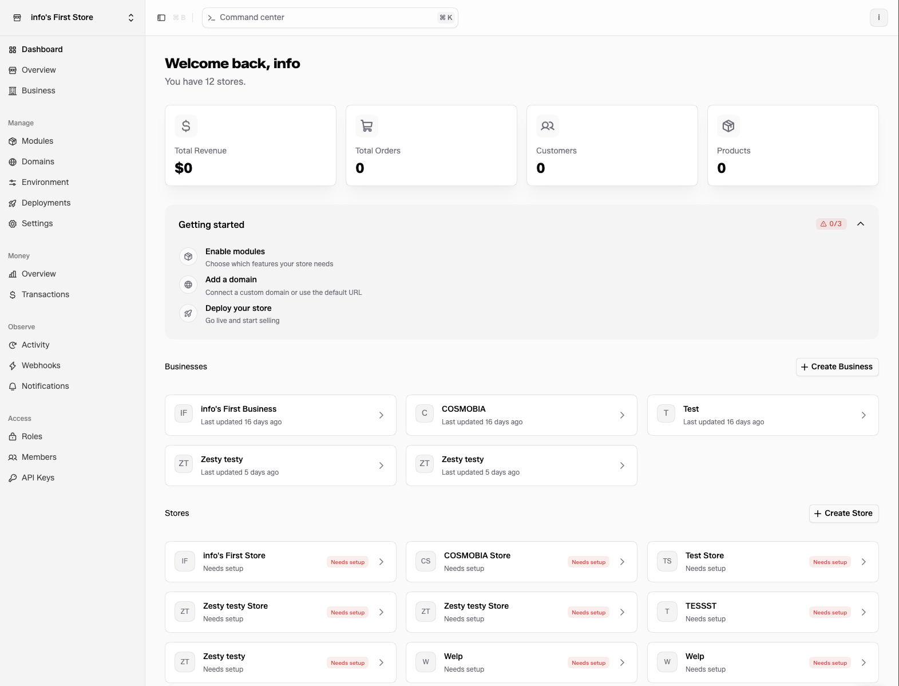
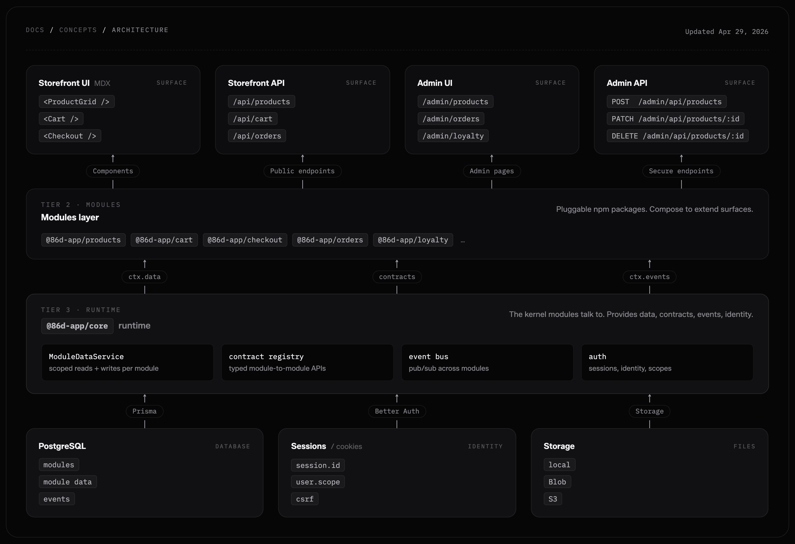

86d is structured so every commerce capability is a small, isolated, replaceable module. This page is the high-level map. Once you have it, every other page in the docs slots in cleanly.

## Big picture




## The monorepo

The 86d source tree is a Bun + Turborepo workspace.

```text
86d/
├── apps/
│   └── store/              The Next.js storefront and admin app
├── modules/                One folder per module (a deep set of first-party modules)
├── packages/
│   ├── core/               Module factory, runtime, types
│   ├── cli/                The `86d` CLI
│   ├── db/                 Prisma schema and ModuleDataService
│   ├── auth/               Better Auth integration
│   ├── storage/            Pluggable storage adapter (local, Vercel, S3)
│   ├── registry/           Registry manifest + module/template fetchers
│   └── ...
├── templates/
│   └── brisa/              Default MDX storefront template
├── registry.json           Manifest of every official module (versions, deps)
└── docker-compose.yml
```

Three production-shipped artifacts come out of this tree: the **store app** (Next.js), the **CLI** (npm package `86d`), and **every module** (npm packages under `@86d-app/*`).

## The runtime

`@86d-app/core` is the runtime that all modules link against. It provides:

- **Module factory and types.** Every module is `(options) => Module`. The module returns its `id`, `version`, schema, endpoints, and components.
- **`ModuleDataService`.** The only way modules touch the database. Each module gets a scoped data service injected at `init` time. Modules never import `@86d-app/db` or any ORM client directly, which is what keeps them swappable and testable.
- **Contract registry.** Modules declare `requires` and `exports` for the data and operations they consume or expose. Cross-module reads happen through `ctx.contracts`, never direct imports.
- **Event bus.** Domain events (`order.placed`, `payment.completed`, `newsletter.subscribed`, ...) are published by the module that owns them and consumed by anyone who declared interest.
- **Auth context.** `ctx.session` exposes the Better Auth session for endpoint handlers.

Read [Modules](/concepts/modules) for the module shape and [Build a custom module](/guides/building-a-module) for the full lifecycle.

## Storefront

The storefront is a Next.js app at `apps/store/`. Pages are MDX files from your active template. Module components are registered automatically into the MDX component registry, and the storefront's catch-all `/api/[...path]` route mounts every module's public endpoints.

See [Storefront](/concepts/storefront).

## Admin

The admin lives at `/admin` in the same Next.js app and uses the same module system. Each module declares which admin sidebar group and subgroup its pages belong to. The sidebar is a two-level structure with nine top-level groups.

See [Admin dashboard](/concepts/admin).

## Templates

A template is a folder of MDX, color tokens, and assets. It controls every visible aspect of the storefront. You can swap or customize templates without touching modules; you can swap modules without touching templates.

See [MDX templates](/concepts/templates) and [`config.json` reference](/configuration/store-config).

## Data layer

Storage is provided by `@86d-app/db` (Prisma + PostgreSQL) for relational data, `@86d-app/storage` for blobs (local filesystem, Vercel Blob, or any S3-compatible bucket), and `@86d-app/auth` (Better Auth) for sessions, OAuth, and SSO.

- **Prisma 7** is the ORM. Schemas live under `packages/db/prisma/`.
- **`STORE_ID`** segments every uploaded file path: `stores/{storeId}/{uuid}`. This is the foundation of multi-tenancy.

See [Storage configuration](/configuration/storage) and [Authentication](/configuration/authentication).

## Hosted vs. self-hosted

When `STORE_ID` and `86D_API_KEY` are set, the store fetches its `config.json` from the 86d hosted API at `86D_API_URL` (`https://api.86d.app` by default) and enables 86d.app SSO for admin authentication. When they are not set, the store reads `templates/<theme>/config.json` from disk and runs entirely standalone.

The same codebase covers both modes. The presence of those two environment variables decides which path the store takes at boot.

## Where to go next

<CardGroup cols={2}>
  <Card title="Modules" icon="boxes-stacked" href="/concepts/modules">
    The contract every feature in 86d follows.
  </Card>
  <Card title="Templates" icon="palette" href="/concepts/templates">
    How MDX templates control your storefront's look and content.
  </Card>
  <Card title="Storefront" icon="store" href="/concepts/storefront">
    The Next.js app that renders your store.
  </Card>
  <Card title="Admin dashboard" icon="layout-dashboard" href="/concepts/admin">
    The two-level sidebar and the admin API.
  </Card>
  <Card title="Agentic design" icon="robot" href="/concepts/agentic-design">
    Why 86d is shaped for AI-assisted development.
  </Card>
  <Card title="Glossary" icon="book" href="/resources/glossary">
    Definitions for every term used in the docs.
  </Card>
</CardGroup>
